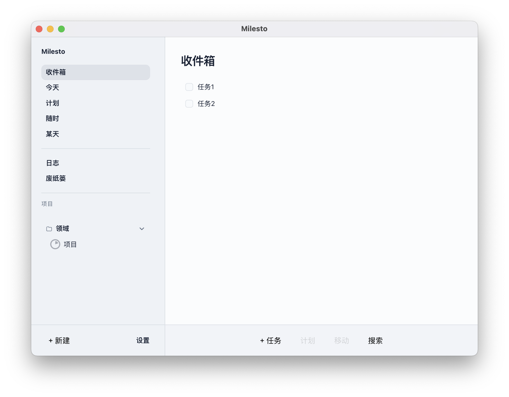
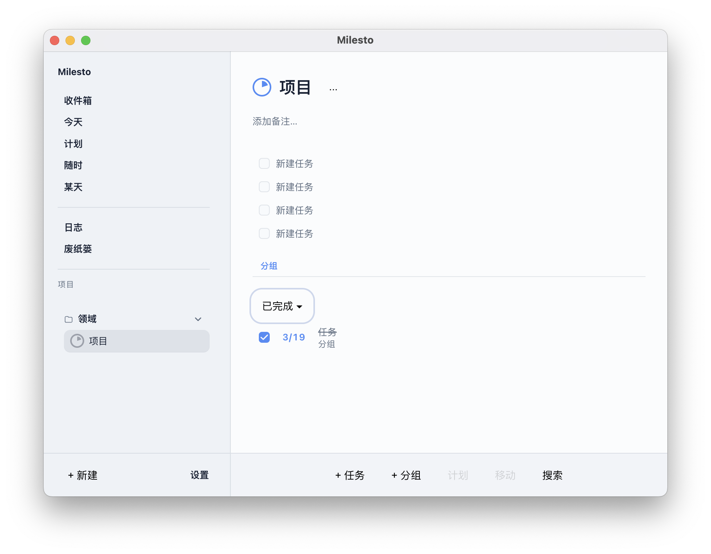
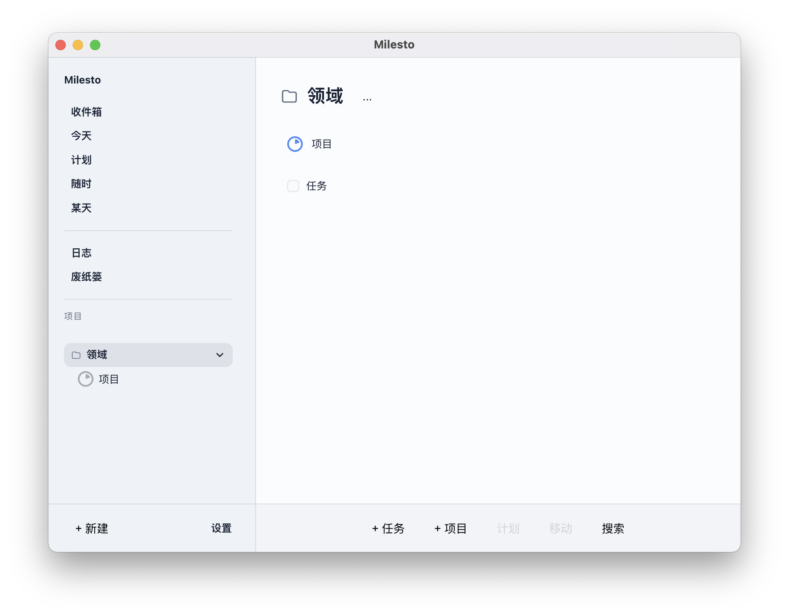

# Milesto

**一个开源的、本地优先的桌面任务管理应用，灵感来自 Things 3。**

简体中文 | [English](./README.md)

Milesto 是一个跨平台桌面应用，用于个人任务管理，覆盖完整的 GTD 工作流：收集、整理、执行、回顾。所有数据以 SQLite 数据库形式存储在本地——无需账号，无需云服务。

<p align="center">
  
  
  
</p>

## 功能特性

- **收件箱** — 低摩擦快速收集新任务
- **今天** — 拖拽排序，规划你的每一天
- **计划 / 随时 / 某天** — 按时间维度组织任务
- **项目与分段** — 将相关任务分组，支持项目内分段管理
- **区域** — 在更高维度组织项目（如工作、生活、学习）
- **标签** — 灵活的跨维度分类标记
- **清单** — 任务内的子项清单，逐步追踪进度
- **全文搜索** — FTS5 驱动，搜索任务标题和备注（万级任务 < 200ms）
- **数据导入 / 导出** — 完整 JSON 备份与恢复，事务性保障数据安全
- **日志簿与垃圾箱** — 回顾已完成任务，恢复误删内容
- **主题** — 浅色、深色、跟随系统
- **国际化** — 英文和简体中文

## 技术栈

| 层级 | 技术 |
|------|------|
| 框架 | [Electron](https://www.electronjs.org/) 30 |
| UI | [React](https://react.dev/) 18 + [TypeScript](https://www.typescriptlang.org/) 5 |
| 构建工具 | [Vite](https://vitejs.dev/) 5 + vite-plugin-electron |
| 数据库 | [SQLite](https://sqlite.org/) via [better-sqlite3](https://github.com/WiseLibs/better-sqlite3)（运行在 worker_threads 中） |
| 样式 | [Tailwind CSS](https://tailwindcss.com/) + [shadcn/ui](https://ui.shadcn.com/) |
| 动画 | [Framer Motion](https://www.framer.com/motion/) |
| 拖拽 | [@dnd-kit](https://dndkit.com/) |
| 虚拟滚动 | [@tanstack/react-virtual](https://tanstack.com/virtual) |
| 数据校验 | [Zod](https://zod.dev/) |
| 国际化 | [i18next](https://www.i18next.com/) |
| 测试 | [Vitest](https://vitest.dev/) + Testing Library |

## 快速开始

### 环境要求

- [Node.js](https://nodejs.org/) >= 18
- npm（随 Node.js 自带）

### 安装与运行

```bash
# 安装依赖
npm ci

# 启动开发模式
npm run dev
```

### 构建

```bash
# 类型检查 + 打包 + 生成安装包
npm run build
```

构建产物输出到 `release/<version>/`：

| 平台 | 格式 | 文件名 |
|------|------|--------|
| macOS | DMG | `Milesto-Mac-<version>-Installer.dmg` |
| Windows | NSIS | `Milesto-Windows-<version>-Setup.exe` |
| Linux | AppImage | `Milesto-Linux-<version>.AppImage` |

### 代码检查与测试

```bash
npm run lint          # ESLint（零警告策略）
npm run test          # 单元测试 + 组件测试
npm run test:db       # DB Worker 行为测试
```

## 架构

Milesto 采用严格的四层 Electron 架构，各层之间有硬隔离边界：

```
┌─────────────────────────────────────────────┐
│  渲染进程 (React)                            │
│  仅通过 window.api.* 调用                    │
├─────────────────────────────────────────────┤
│  预加载脚本 (contextBridge)                  │
│  仅暴露业务级 API                            │
├─────────────────────────────────────────────┤
│  主进程                                      │
│  窗口生命周期、IPC 网关                       │
├─────────────────────────────────────────────┤
│  DB Worker (worker_threads)                 │
│  唯一的 SQLite 访问点，串行化请求            │
└─────────────────────────────────────────────┘
```

**关键约束：**
- `contextIsolation: true`、`nodeIntegration: false`
- 渲染进程无法直接访问 `ipcRenderer` 或执行任意 SQL
- 所有 IPC 数据通过 Zod schema 校验
- 所有数据库写操作均在事务中执行

## 项目结构

```
electron/
  main.ts                 # 主进程入口
  preload.ts              # 预加载脚本
  workers/db/
    db-worker.ts          # DB Worker 入口
    actions/              # 业务逻辑（task、project、area、tag 等）

src/
  App.tsx                 # 根组件
  app/
    AppRouter.tsx         # 路由定义
    AppShell.tsx          # 侧边栏 + 内容区布局
  pages/                  # 路由页面（Today、Inbox、Upcoming 等）
  features/               # 功能域（tasks、projects、settings 等）
  components/             # 共享 UI 组件
  i18n/                   # i18next 配置

shared/
  window-api.ts           # window.api 类型契约
  schemas/                # Zod schemas（数据模型的唯一来源）
  result.ts               # Result<T> 类型
  app-error.ts            # 结构化错误类型
```

## 参与贡献

1. 在进行重要改动前，请先阅读 `docs/` 下的文档：
   - `redlines.md` — 硬性约束（最高优先级）
   - `standards.md` — 工程规范
   - `ui.md` — UI/UX 规则
   - `tech-framework.md` — 架构决策
2. 遵循现有代码风格（TypeScript strict、2 空格缩进、单引号）。
3. 提交前运行 `npm run lint`，确保零警告。

## 许可证

本项目尚未选定开源许可证。在许可证确定之前，所有权利归作者所有。
