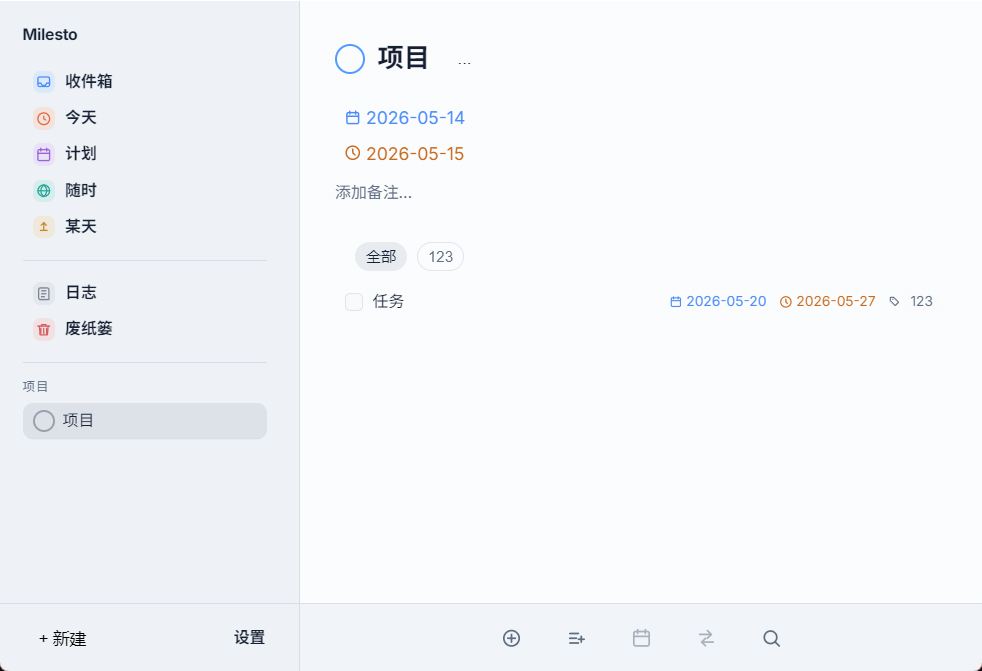
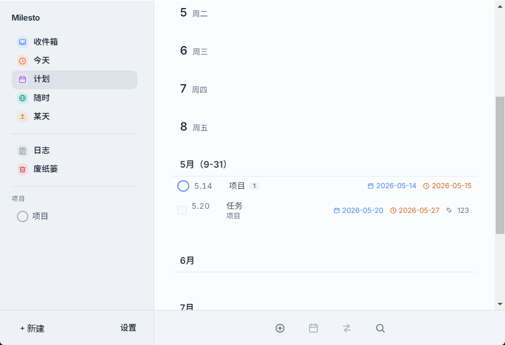

# Milesto

一个受 Things 启发的、专注于键盘操作的桌面任务管理应用。基于 Electron、React 和 SQLite 构建。


[English](README.md) | **简体中文**

## 功能特性

- **智能清单**：收件箱、今天、计划、随时、某天、日志、废纸篓
- **项目与区域**：将任务组织到项目中，按区域对项目进行分组
- **快捷捕获**：通过全局快捷键随时随地添加任务
- **拖拽排序**：直观地重新排列任务、项目和区域
- **全文搜索**：跨所有任务和项目进行快速搜索
- **日期管理**：为任务安排日程、设置截止日期、查看未来一周的待办
- **离线优先**：所有数据本地存储在 SQLite 中，无需网络即可使用
- **云端同步**（可选）：基于 WebSocket 的同步引擎，支持多设备协同
- **国际化**：多语言支持（i18n）

## 技术栈

| 层级 | 技术 |
|------|------|
| 前端 | React 18, TypeScript, Vite |
| 桌面端 | Electron 30 |
| 数据库 | better-sqlite3（Worker Thread）|
| 状态管理 | React Context + 乐观更新 |
| 拖拽 | @dnd-kit |
| 虚拟滚动 | @tanstack/react-virtual |
| 测试 | Vitest + React Testing Library |

## 界面预览

### 项目视图



### 计划视图



## 架构

Milesto 采用三层通信架构：

```
渲染进程 (React)     →    主进程 (Node)     →    DB Worker 线程
      |                           |                           |
   contextBridge            ipcMain.handle()          Worker.postMessage()
   window.api                                                better-sqlite3
```

所有 SQLite 操作都在独立的 DB Worker 线程中执行，保持 UI 流畅响应。

## 快速开始

**环境要求**：Node.js 20+ 和 npm。

```bash
# 安装依赖
npm install

# 启动开发环境（Vite + Electron）
npm run dev

# 运行测试
npm test

# 运行数据库测试
npm run test:db

# 生产构建
npm run build
```

## 开发命令

| 命令 | 说明 |
|------|------|
| `npm run dev` | 启动开发服务器 |
| `npm run build` | 完整生产构建 |
| `npm test` | 运行测试套件（Electron Node 运行时）|
| `npm run test:watch` | 测试监视模式 |
| `npm run test:db` | 运行 DB Worker 测试 |
| `npm run lint` | 运行 ESLint |
| `npm run preview` | 预览生产构建 |

## 项目结构

```
src/              React 渲染进程（页面、组件、功能模块）
electron/         Electron 主进程 + preload + DB worker
  main.ts         入口：创建窗口、注册 IPC 处理器、启动 DB worker
  preload.ts      上下文桥接（window.api）
  workers/db/     DB Worker 线程（SQLite 操作）
  sync/           云端同步引擎（WebSocket）
shared/           共享代码（schema、类型、i18n、result monad）
tests/            测试套件（渲染器测试、单元测试、DB 测试）
```

## 安全

- `contextIsolation: true`, `nodeIntegration: false`
- Preload 仅暴露类型化的业务级 API — 不暴露原始 `ipcRenderer`
- 所有 IPC 处理器进行发送方来源验证
- `better-sqlite3` 无法从渲染进程直接访问

## 许可

MIT © 2026 Maplume
